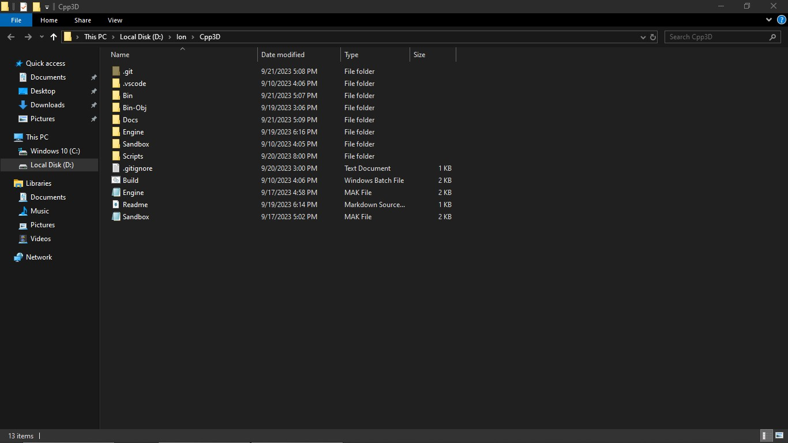

# How to setup the Core Game Engine.

## Requirements

1. Text editor, recommended Visual Studio Code.
2. MinGW-64, comes with make, g++ and other tools.
3. Windows OS. So far this game engine only supports Windows as I don't have access to other platforms (sorry).

# How To Build:

1. Clone
2. Prepare
3. Run build scripts

## Clone

Clone this repository, either with Git or from Github, and put the code in a empty folder on your machine.

## Prepare

1. Go in the root directory, where the Engine, Sandbox and Scripts folders are (along other folders).
2. Open a CMD window in the root directory. Open the root directory in the file explorer. 
3. Click at the top and write "cmd" then hit enter.

## Run build script

With CMD opened there is a script to run inside the Scripts folder. It is called "Setup.bat". Inside CMD write: "call Scripts/Setup.bat" then press enter.

## Outcome

If everything is correct, in the root directory there should be a Bin and Bin-Obj folder, In the Bin folder there should be some DLL's and a EXE, launching the EXE will execute the code inside "Sandbox". If everything is correct, the setup should be ran once or if the Bin folder is deleted. If modifications are done to the Engine source code (inside of Engine/Source) or modifications are done in "Sandbox", then only Build.bat from the root directory should be called.

### About "Setup.bat"

This script will:

1. Make a Bin folder.
2. Copy glfw3.dll in Bin.
3. Build third-party libraries like glad and ImGui.
4. Copy assets to Bin to be used.
5. Build from source.

Each task is separated in different bat files.
